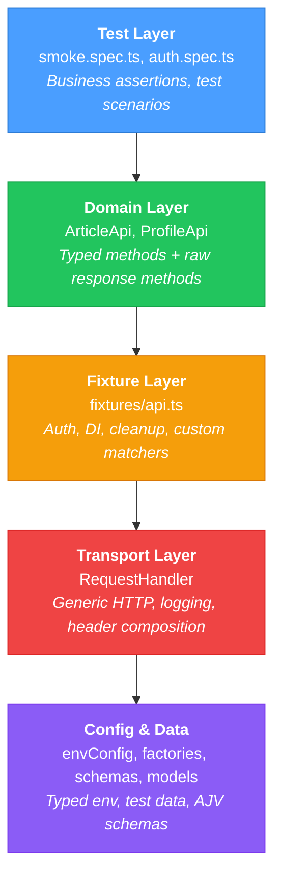

# Playwright API Test Framework

[](https://github.com/maksimTrs/pw-api-framework/actions/workflows/ci.yml)


Production-grade API test automation framework built with Playwright and TypeScript.
Designed as a reference architecture for scalable, maintainable API testing.

## Key Features

- **Layered architecture** — transport, domain, fixture, and test layers with clear boundaries
- **Strict TypeScript** — `strict: true` + `noUncheckedIndexedAccess`, typed models for all API shapes
- **Dual-method API clients** — happy-path methods with built-in assertions + raw response methods for custom checks
- **Custom matchers** — `toHaveStatus()` with detailed error output, `toMatchSchema()` for AJV validation
- **Fixture-based DI** — worker-scoped auth, test-scoped API clients, automatic resource cleanup
- **JSON Schema validation** — AJV with compiled validator caching via WeakMap
- **Factory pattern** — `createArticlePayload(overrides?)` with Faker.js and `Partial<T>` support
- **Request/response logging** — opt-in verbose mode with sensitive field masking
- **CI/CD pipeline** — GitHub Actions: lint → test → JUnit report → HTML report on GitHub Pages
- **Docker support** — Alpine-based container with layer caching and proper signal handling
- **Pre-commit hooks** — Husky + lint-staged runs ESLint on staged files

## Architecture



## Project Structure

```
tests/
  api/                      — API test specs (one file per resource/feature)
    schemas/                — JSON Schema validation tests
  fixtures/                 — Playwright fixtures (auth, API clients, cleanup, custom matchers)
  helpers/                  — RequestHandler, API clients, logger, schema validator, env config
  models/                   — TypeScript interfaces (Article, User, Profile, Tag, Error)
  data/                     — test data factories and constants
  schemas/                  — AJV JSON Schema definitions
  global.setup.ts           — API health check before test run
playwright.config.ts
tsconfig.json
eslint.config.mjs
Dockerfile
docker-compose.yml
```

## Test Example

```typescript
test('POST /articles', {tag: '@smoke'}, async ({articleApi, articleCleanup}) => {
    const payload = createArticlePayload();

    const response = await articleApi.createArticleResponse(payload);

    await expect(response).toHaveStatus(201);

    const body = await response.json() as ArticleResponse;
    articleCleanup.track(body.article.slug);

    expect.soft(body.article.title).toBe(payload.article.title);
    expect.soft(body.article.author.username).toBeTruthy();
});
```

Key patterns visible:
- **`articleApi`** — domain client injected via fixture (authenticated)
- **`articleCleanup.track()`** — registers resource for automatic teardown
- **`toHaveStatus(201)`** — custom matcher with URL and body in error output
- **`expect.soft()`** — continues after failure, reports all mismatches

## Getting Started

```bash
# Clone
git clone https://github.com/maksimTrs/pw-api-framework.git
cd pw-api-framework

# Install dependencies
npm install

# Configure environment
cp .env.example .env
# Edit .env with your Conduit API credentials
```

## Running Tests

| Command | Description |
|---|---|
| `npm test` | Run all tests |
| `npm run test:verbose` | Run with request/response logging |
| `npm run test:grep -- @smoke` | Run tests by tag |
| `npm run test:grep -- @security` | Run security/auth tests |
| `npm run test:schema` | Run schema validation tests |
| `npm run lint` | Check code style |
| `npm run lint:fix` | Auto-fix lint errors |

## Docker

Run tests in an isolated container:

```bash
npm run docker:build           # Build image
npm run docker:test            # Run all tests
npm run docker:test:verbose    # With request/response logging
npm run docker:test:smoke      # Smoke tests only
npm run docker:test:schema     # Schema tests only
```

Reports mount to `./playwright-report/` on the host — open with `npx playwright show-report`.

## CI/CD

The GitHub Actions pipeline runs on every push and PR to `main`:

```
Lint (ESLint) → Test (4 parallel workers) → JUnit Report → Deploy HTML Report to GitHub Pages
```

- Browser download skipped (API-only — saves ~600MB in CI)
- Test results parsed via `mikepenz/action-junit-report` with detailed summary
- HTML report deployed to GitHub Pages on `main` branch pushes
- Dependabot keeps npm packages and GitHub Actions up to date

## Design Decisions

| Decision | Why |
|---|---|
| **Dual-method API clients** | Happy-path methods (`createArticle()`) return typed data with status assertion. Raw methods (`createArticleResponse()`) return `APIResponse` for negative tests, schema checks, and custom assertions. Both share the same transport — no duplication. |
| **Worker-scoped auth** | Login once per worker via fixture chain: `loginUser` → `authToken` → `authApi` → `ArticleApi`. Tests share the token without re-authenticating — fast and parallel-safe. |
| **Custom matchers over raw expect** | `toHaveStatus()` includes URL and response body in error output — no manual debugging. `toMatchSchema()` wraps AJV with human-readable error messages. |
| **Fixture-based cleanup** | `articleCleanup` tracks slugs during test, deletes via `Promise.allSettled()` in teardown. Resilient to individual failures — one stuck resource doesn't block others. |
| **Factory + Partial\<T\>** | `createArticlePayload(overrides?)` generates unique data with Faker.js. Override any field via `Partial<T>` — no fixtures files, no shared state. |
| **Schema caching** | AJV validators compiled once, cached via `WeakMap` keyed by schema object reference. Same schema across tests = zero recompilation. |
| **Typed environment config** | `envConfig.ts` validates required vars at startup and fails fast with a clear message — no cryptic `undefined` errors mid-test. |

## Tech Stack

| Tool | Version | Role |
|---|---|---|
| [Playwright Test](https://playwright.dev/) | 1.58 | Test runner, assertions, API client |
| TypeScript | 5.9 | Strict static typing |
| AJV | 8.18 | JSON Schema validation |
| Faker.js | 10.3 | Test data generation |
| ESLint | 10.0 | Static analysis (flat config) |
| Husky + lint-staged | 9.1 / 16.4 | Pre-commit hooks |
| Docker | Alpine | Containerized test execution |
| GitHub Actions | — | CI/CD pipeline |
